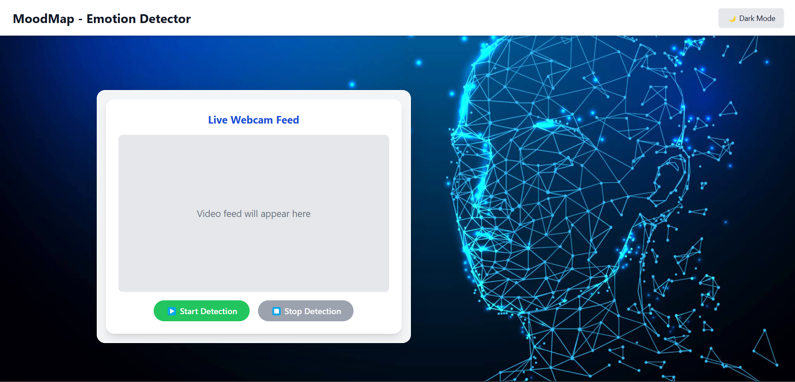

# 🌐 MoodMap – Frontend

A modern, responsive real-time emotion detection interface built with **React** and **Tailwind CSS**.  
This frontend connects to a Flask backend to display live webcam feed and detect human emotions with elegant UI, dark mode, and responsive design.

🔗 **Live Demo**: [https://super-snickerdoodle-46bef1.netlify.app](https://super-snickerdoodle-46bef1.netlify.app)

> 💻 Real-time camera stream powered by Flask backend running locally.

---

## 📸 UI Preview



---

## ⚡ Features

- 🧠 Live emotion detection from webcam feed
- 🌙 Toggleable dark/light mode UI
- 🎛️ Start & stop detection with animated buttons
- 📱 Fully responsive layout
- 🎥 Smooth webcam stream integration
- 🖼️ Background image, modern layout, and Framer Motion animations (optional)

---

## 🛠️ Tech Stack

- **React.js** – Frontend framework
- **Tailwind CSS** – Styling utility classes
- **React Hooks** – For managing detection state
- **Heroicons** / **React Icons** – For minimalistic icons
- **Flask (API)** – Backend service (local)

---

## ⚙️ Getting Started

### 1. Clone the frontend repo

```bash
git clone https://github.com/anshul-3000/Moodmap_frontend.git
cd Moodmap_frontend
```
## 2. Install dependencies
```bash
npm install
```
## 3. Connect to backend
Make sure the Flask backend is running locally at:
```arduino
http://localhost:5000
```
The backend must be run locally to access your webcam.

## 4. Update backend URL
In WebcamViewer.js, update:
```js
const BACKEND_URL = "http://localhost:5000"; // or your live backend if hosted locally
```
### 🚀 Run the App
```bash
npm start
```
App will be available at:
🌍 http://localhost:3000

### 🛰️ Production Build (Optional)
```bash
npm run build
```
Deploy the /build folder to Netlify, Vercel, or any static host.

### 🤝 Backend Repository
[🔗 MoodMap Backend GitHub](https://github.com/anshul-3000/Moodmap_backend)

### 📦 Flask backend handles:
-Video feed
-Emotion detection
-REST API

### 👨‍💻 Developed By
Anshul Chaudhary
🚀 Full Stack Developer | ML Engineer | UI/UX Enthusiast

Made with 💙 using React, Tailwind, Flask & TensorFlow

📌 Note
-Webcam stream is served via Flask backend, which must be run locally due to hardware access limitations.
-If deploying backend to cloud, use image POST-based prediction or WebRTC with socket streaming (future feature!).
